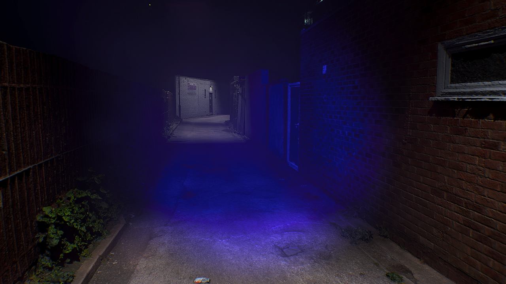
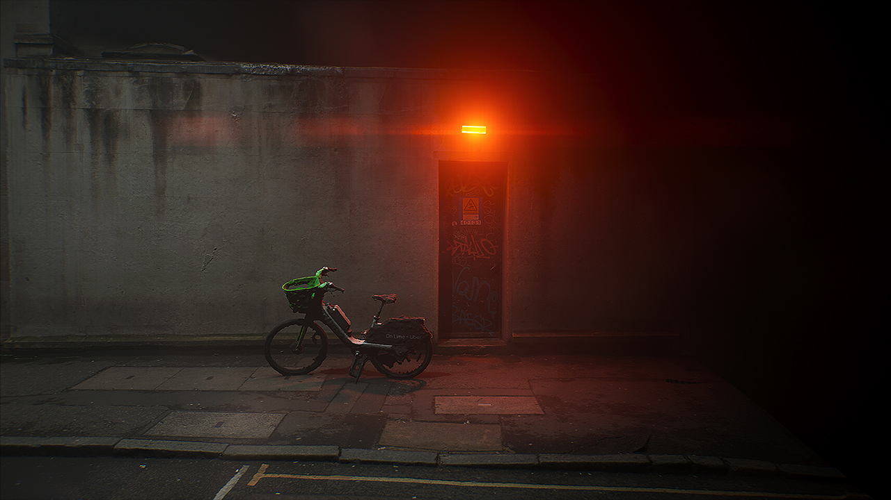
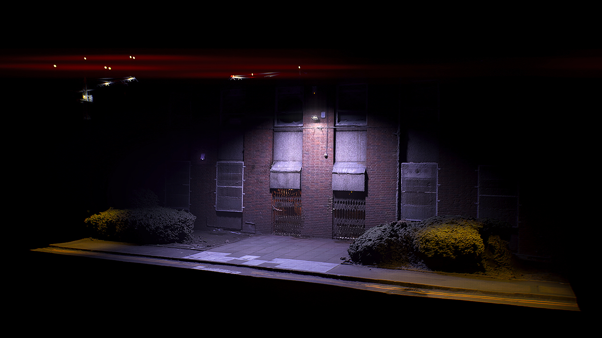

# Partial Defrag: ScanDisk [STRATA]

Listening & Download link for Partial Defrag *ScanDisk* on STRATA for Radio X Press X Personal enjoyment

### Release Date: 29.11.24
 
[Private Streaming & Download link](https://www.openai.com) (*Please do not share*)
For all enquiries, please contact: **strata.edition@gmail.com**

---

*“A hard drive storing the after-dark, compressed and space-optimised.”*

**ScanDisk** is the debut release of London-based artist **Partial Defrag**. Whispered voices, car engines, and ethereal club hooks are cut up, compressed, and congealed into a fluid, late-night motif for a spectral, industrial London. Partial Defrag’s free-form compositions are the leftovers of a hard drive compression: space-optimised memories tainted with artifacts.
  

---

This is an audio-visual release accompanied by three videos and a limited run of 50 Blue CDs, packaged in anti-static hard drive bags.
  

  
---
## Videos
**ScanDisk** is accompanied by three videos created by the artists mixing 3D scans and phone footage of London's suburbs. The material was reassembled into fictional urban-industrial scenes. 

*~(click to open)~*

---
## Tracklist

1. Elmelin
2. Bates
3. Pulsarnet
4. Wholesalers
5. Squat
6. VFS
  
---
## Credits
- Written and Produced: **Partial Defrag**
- Mastering: **Fausto Mercier**
- Mixing: **Pietro Bardini** at **RCA Studios**
- Cover and CD Design: **Partial Defrag**
- Videos Production: **Partial Defrag**
  
---
## Artist Bio
Partial Defrag (b. 9/8/24) [28/32GB] 
*"In the empty space of a semi-compressed hard drive, melodic phrases keep on playing."*
