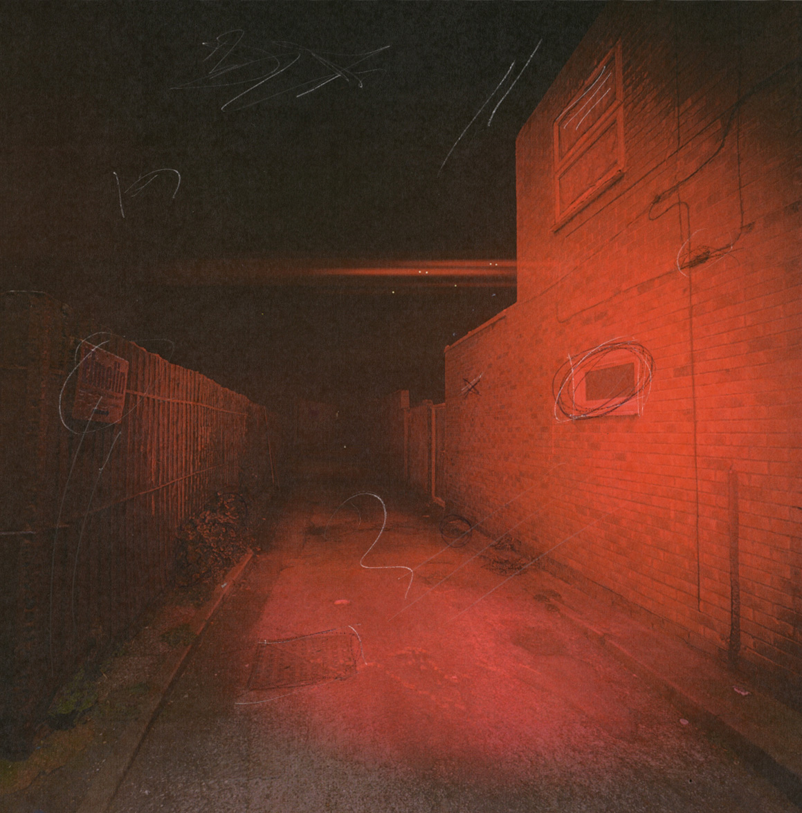

# Partial Defrag: ScanDisk

*Listening & Download link for Partial Defrag 'ScanDisk' on STRATA for DJ / Radio / Press / Personal enjoyment etc etc.*

For all inquiries, please contact: strata.edition@gmail.com

**Release Date : 27.10.24**

*Please do not share* Private Streaming / WAV download : https://bit.ly/3GYobu7

---

"*In the empty of a semi-compressed hard drive*"

**ScanDisk** is the debut release of London-based artist **Partial Defrag**. Whispered voices, car engines, and ethereal club anthems are cut up, compressed, and congealed into a fluid, late-night motif for a spectral, industrial London. Partial Defrag’s free-form compositions are what remains after a hard drive compression: space-optimized memory tainted with artifacts.

---

## Tracklist

1. Whispering Engines
2. Ethereal Compression
3. Fluid Motif
4. Spectral London
5. Artifact Remains

## Artist Information

**Artist Name**: Partial Defrag
**Location**: London, UK
**Genre**: Experimental, Ambient, Industrial, IDM

## Press & Media

---
