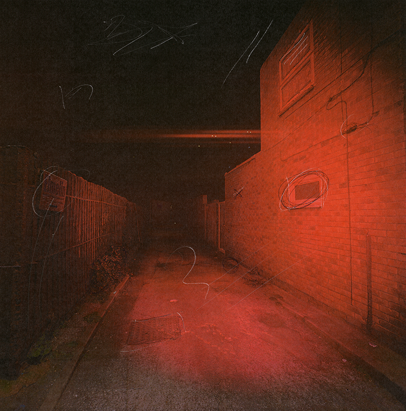
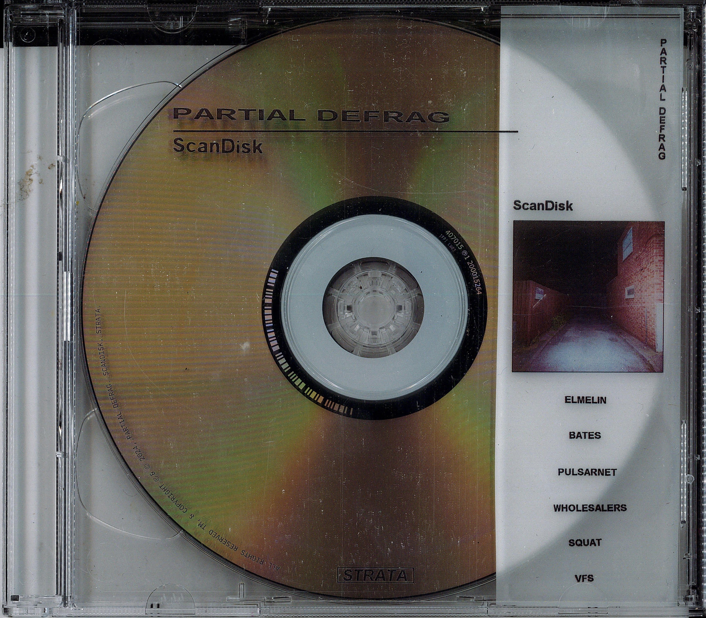
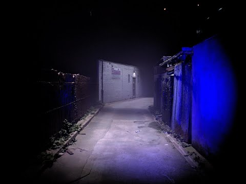
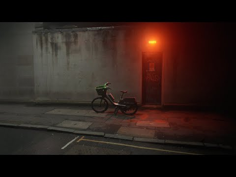

# Partial Defrag: ScanDisk [STRATA]

Listening & Download link for Partial Defrag *ScanDisk* on STRATA for DJ / Radio / Press / Personal enjoyment etc.

### Release Date: 25.10.24
 

[Private Streaming & Download link](https://www.openai.com) (*Please do not share*)
For all enquiries, please contact: **strata.edition@gmail.com**

---
**ScanDisk** is the debut release of London-based artist **Partial Defrag**. Whispered voices, car engines, and ethereal club anthems are cut up, compressed, and congealed into a fluid, late-night motif for a spectral, industrial London. Partial Defrag’s free-form compositions are the leftovers of a hard drive compression: space-optimised memories tainted with artifacts.

This is an audio-visual release accompanied by a limited run of 50 CDs and three videos.

---
## Videos
**ScanDisk** is accompanied by three videos created by the artists mixing 3D scans and phone footage of London's suburbs. The material was reassembled into fictional urban-industrial scenes. Videos and music were created at the same time, one form affecting the other. *~(click on the images to open the links)~*

---
## Tracklist

1. Elmelin
2. Bates
3. Pulsarnet
4. Wholesalers
5. Squat
6. VFS

---
## Credits
- Written and Produced by **Partial Defrag**
- Mastering by **Fausto Mercier**
- Mixing by **Pietro Bardini** at **RCA Studios**
- Cover and CD Design by **Partial Defrag**
- Videos Production by **Partial Defrag**

---
## Artist Bio
Partial Defrag (b. 9/8/24) [28/32GB] 
*In the empty space of a semi-compressed hard drive, melodic phrases keep on playing.*
Partial Defrag is a London-based audio-visual artist.
